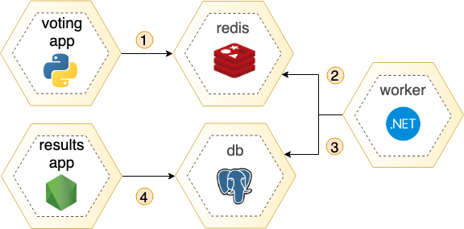

# voting-app

A simple distributed application running across multiple Docker containers developed by [Docker Team](https://github.com/dockersamples/example-voting-app).

## Run the app in Kubernetes

In this folder, just run

```sh
kubectl apply -f .
```

Run `kubectl get pod` to see the created pods. The result will looks like bellow

```sh
NAME                      READY   STATUS    RESTARTS   AGE
db-857489b6-9jcsq         1/1     Running   0          5m5s
redis-8596cf79f6-7d29v    1/1     Running   0          5m5s
result-59977485df-vvxm6   1/1     Running   0          5h33s
vote-5d455b5d44-fl25k     1/1     Running   0          5m5s
worker-64cb5879d9-2jgcq   1/1     Running   0          5m5s
```

Run `kubectl get svc` to see the created services. The result will looks like bellow

```sh
NAME         TYPE           CLUSTER-IP       EXTERNAL-IP   PORT(S)          AGE
db           ClusterIP      10.109.170.252   <none>        5432/TCP         5m
kubernetes   ClusterIP      10.96.0.1        <none>        443/TCP          15m
redis        ClusterIP      10.99.205.151    <none>        6379/TCP         4m22s
result       LoadBalancer   10.106.173.182   localhost     8080:30561/TCP   3m52s
vote         LoadBalancer   10.108.30.199    localhost     8081:31761/TCP   6m17s
```

The vote app is running on **8081** port. Open [http://localhost:8081/](http://localhost:8081/) to choose between cats and dogs!

The result app is running on **8080** port. Open [http://localhost:8080/](http://localhost:8080/) to see the result.

## Architecture



* A front-end web app in Python which lets you vote between two options
* A Redis queue which collects new votes
* A .NET Core worker which consumes votes and stores them in…
* A Postgres database backed by a Docker volume
* A Node.js webapp which shows the results of the voting in real time

## Note

The [original voting](https://github.com/dockersamples/example-voting-app) application only accepts one vote per client, however, this version registers votes even if a vote has already been submitted from a client.